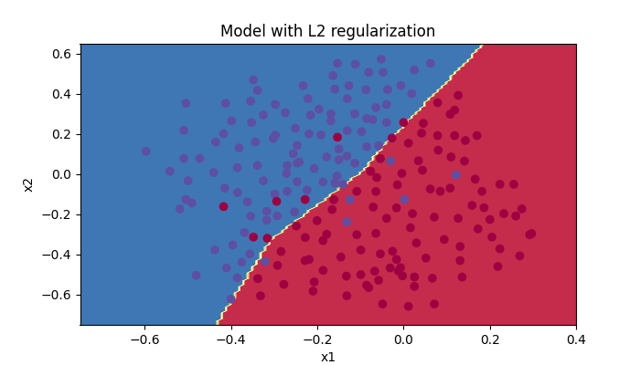

#<center>neural-network</center>

---
**neural-network** is a Python package that provides a Multi-Layer Perceptron (MLP) 
framework built using only **NumPy**. The framework supports Gradient Descent, Momentum, RMSprop, Adam optimizers.

## Installation

###Dependencies
The package requires:
* Python (>= 3.8)
* NumPy (>= 1.22.1)
* matplotlib (>= 3.5.1 )

### User installation
You can install neural-network using `pip`:
```
pip install neural-network
```

## Simple Usage

### Defining the Model Architecture
To define your model, you need to specify the number of layers, and the number of neurons.
```python
from neural_network import NeuralNetwork

model = NeuralNetwork(neurons=[64, 120, 1])
```
In this example, we have a four-layer neural network with auto-defined input neurons, 
first hidden layer with 64 neurons, second hidden layer with 120 neurons, and one output neuron.

### Training the Model
To train the model, you need to provide input data and the corresponding target data.
```python
X = np.array([[0, 0], [0, 1], [1, 0], [1, 1]])
y = np.array([[0], [1], [1], [0]])

model.fit(X, y, epochs=1000, learning_rate=0.1, optimizer='adam')
```
When training the model without manually setting the parameters, the activation functions, or/and the loss functions,
the framework will automatically do the job for you.
It will initialize the parameters, and the functions according to the type of model (regression or classification) and
its architecture.

### Making Predictions
Once the model is trained, you can use it to make predictions.
```python
predictions = model.predict(X)
```

## Beyond the Framework
Apart from the neural network framework, the package also provides:
### Activation functions
<table>
<tr>
    <td><a href="https://en.wikipedia.org/wiki/Sigmoid_function">Sigmoid function</a></td>
    <td><code>sigmoid()</code></td>
</tr>
<tr>
    <td><a href="https://www.medcalc.org/manual/tanh-function.php">Hyperbolic tangent function</a></td>
    <td><code>tanh()</code></td>
</tr>
<tr>
    <td><a href="https://paperswithcode.com/method/relu">Rectified linear unit</a></td>
    <td><code>relu()</code></td>
</tr>
<tr>
    <td><a href="https://paperswithcode.com/method/leaky-relu">Leaky Rectified linear unit</a></td>
    <td><code>leaky_relu()</code></td>
</tr>
<tr>
    <td><a href="https://en.wikipedia.org/wiki/Softmax_function">Softmax function</a></td>
    <td><code>softmax()</code></td>
</tr>
<tr>
    <td><a href="https://paperswithcode.com/method/gelu">Gaussian error linear unit</a></td>
    <td><code>gelu()</code></td>
</tr>
</table>

All above functions have 2 parameters:
* `x`: The input values. Even though some functions can accept numeric primitive data type,
  it is advised to use NumPy array.
* `derivative`: A boolean value indicating whether the function computes the derivative on input `x`. Default is False.

### Loss functions
<table>
<tr>
    <td><a href="">Logistic loss function</a></td>
    <td><code>log_loss()</code></td>
</tr>
<tr>
    <td><a href="">Cross-entropy loss function</a></td>
    <td><code>cross_entropy_loss()</code></td>
</tr>
<tr>
    <td><a href="">Quadratic loss function</a></td>
    <td><code>quadratic_loss()</code></td>
</tr>
</table>

All above functions have 3 parameters:
* `y_pred`: Predicted labels. It must be a 2D NumPy array and have the same size as `y_true`.
* `y_true`: True labels. It must be a 2D NumPy array and have the same size as `y_pred`.
* `derivative`: A boolean value indicating whether the function computes the derivative. Default is False.

### 2D Decision Boundary Plotting
This utility function is used for illustrative purpose. It takes a trained binary classification model, 
a 2D NumPy input data with 2 attributes, and the corresponding binary label data as input. \
The input model is not necessarily an instance of **NeuralNetwork**, but it must have `predict`
method that accepts a 2D NumPy array as input.
```python
plot_decision_boundary(model, train_x, train_y)
```
<center></center>

## License
This project is licensed under the MIT License, as found in the [LICENSE](LICENSE) file.